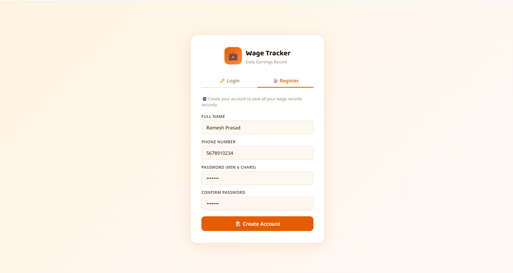
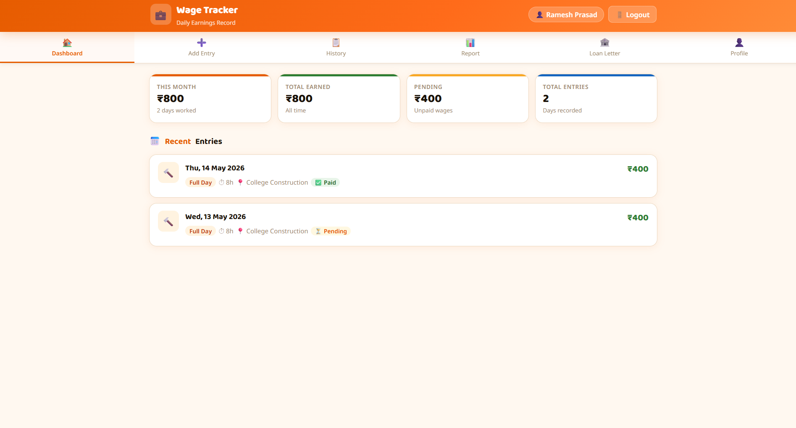
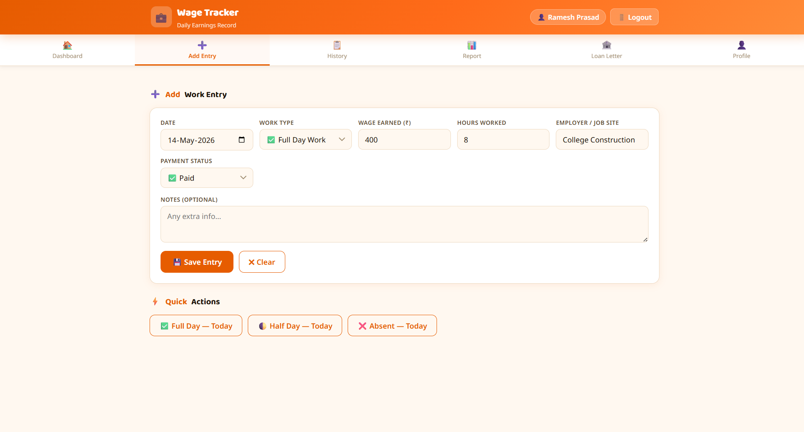
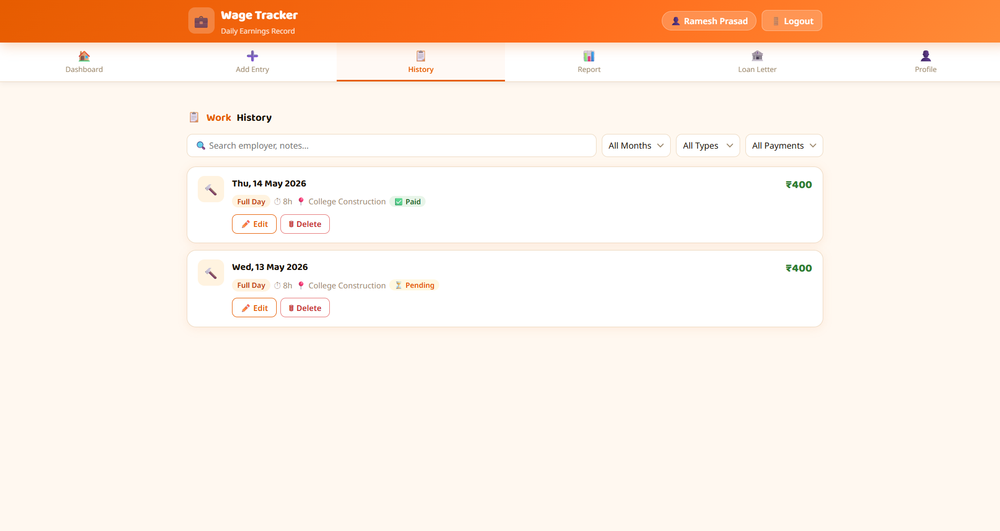
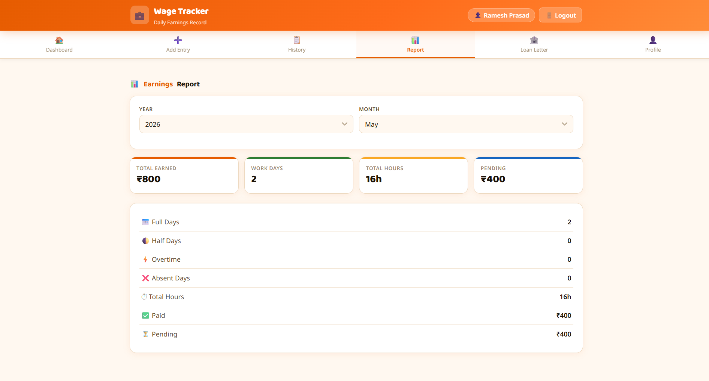
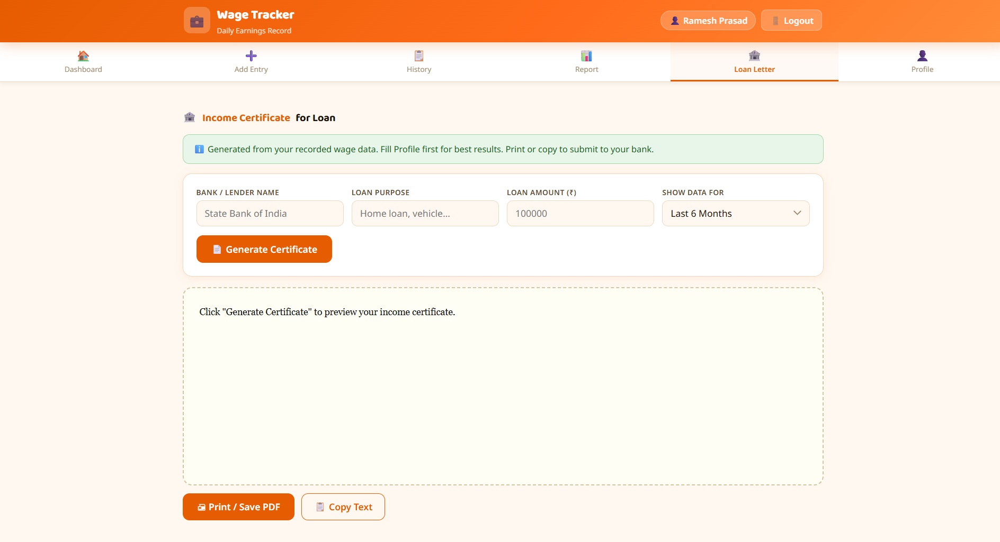
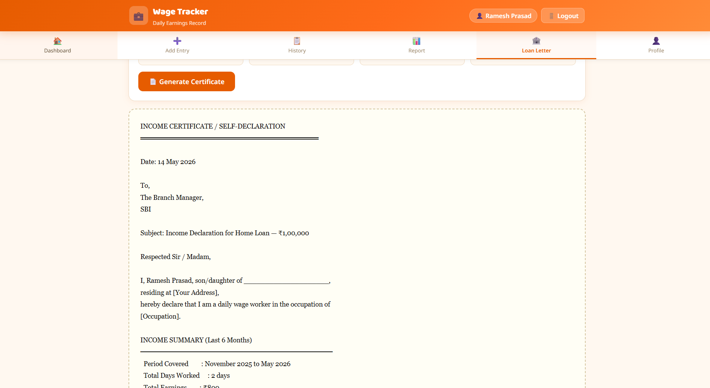

# 💼 Daily Wage Tracker
### *Daily Earnings Record — Built for Daily Wage Workers*

A full-stack web application that helps daily wage workers **track their earnings**, manage work history, monitor payment status, and generate **income certificates for loan applications** — all backed by a persistent MongoDB database.

---

## 📸 Screenshots

### 🔐 Login / Register


### 🏠 Dashboard


### ➕ Add Work Entry



### 📋 Work History


### 📊 Earnings Report


### 🏦 Loan Letter Generator



---

## ✨ Features

- 🔐 **Login / Register** — Phone number + password authentication with JWT
- 💾 **Persistent Storage** — All data saved in MongoDB, never lost
- ➕ **Add Work Entries** — Full Day, Half Day, Overtime, Holiday, or Absent
- 💰 **Payment Tracking** — Mark wages as Paid / Pending / Partial
- ⚡ **Quick Actions** — One-click buttons to log today as Full Day, Half Day, or Absent
- 📋 **Work History** — Search & filter by month, work type, and payment status; edit or delete any record
- 📊 **Earnings Report** — Monthly breakdown with total earned, work days, total hours, and paid vs. pending
- 🏦 **Loan Income Certificate** — Auto-generate a formal self-declaration letter for bank submissions; print or copy
- 👤 **Worker Profile** — Name, Aadhaar, occupation, daily rate, and address for better certificate generation

---

## 🛠️ Tech Stack

| Layer | Technology |
|-------|-----------|
| Runtime | Node.js v16+ |
| Framework | Express.js |
| Database | MongoDB + Mongoose |
| Auth | JWT + bcryptjs |
| Frontend | Vanilla HTML, CSS, JavaScript (Single Page App) |

---

## 📁 Project Structure

```
Daily_Wage_Tracker/
├── server.js              ← Express server (entry point)
├── .env                   ← Environment variables (create this)
├── .env.example           ← Template for .env
├── package.json
├── models/
│   ├── User.js            ← User schema (auth + profile)
│   └── Entry.js           ← Work entry schema
├── routes/
│   ├── auth.js            ← Register, Login, Profile APIs
│   └── entries.js         ← CRUD APIs for work entries
├── middleware/
│   └── auth.js            ← JWT verification middleware
└── public/
    └── index.html         ← Full frontend (HTML + CSS + JS)
```

---

## 🚀 Getting Started

### 1. Prerequisites

- **Node.js** v16+ → https://nodejs.org
- **MongoDB** (local or Atlas)
  - Local: https://www.mongodb.com/try/download/community
  - Free cloud: https://www.mongodb.com/atlas/database

### 2. Clone & Install

```bash
git clone https://github.com/your-username/Daily_Wage_Tracker.git
cd Daily_Wage_Tracker
npm install
```

### 3. Create `.env` file

```bash
cp .env.example .env
```

Edit `.env`:

```env
PORT=3000
MONGODB_URI=mongodb://localhost:27017/wage_tracker
JWT_SECRET=change_this_to_a_long_random_string
JWT_EXPIRES_IN=7d
```

> For **MongoDB Atlas**, replace `MONGODB_URI` with your Atlas connection string:
> `mongodb+srv://<user>:<pass>@cluster0.xxxxx.mongodb.net/wage_tracker`

### 4. Start MongoDB (local only)

```bash
# macOS / Linux
mongod --dbpath /data/db

# Windows
"C:\Program Files\MongoDB\Server\7.0\bin\mongod.exe" --dbpath "C:\data\db"
```

### 5. Run the App

```bash
# Production
npm start

# Development (with nodemon)
npm run dev
```

Open your browser: **http://localhost:3000**

---

## 🔌 API Endpoints

### Auth

| Method | URL | Description |
|--------|-----|-------------|
| POST | `/api/auth/register` | Register new user |
| POST | `/api/auth/login` | Login |
| GET | `/api/auth/me` | Get current user |
| PUT | `/api/auth/profile` | Update profile |

### Entries *(all require Bearer token)*

| Method | URL | Description |
|--------|-----|-------------|
| GET | `/api/entries` | List all entries (with filters) |
| POST | `/api/entries` | Create new entry |
| PUT | `/api/entries/:id` | Update entry |
| DELETE | `/api/entries/:id` | Delete entry |
| GET | `/api/entries/stats` | Summary statistics |
| GET | `/api/entries/report/:year` | Monthly breakdown |

---

## 📱 How to Use

1. **Register** — Create an account with your full name, phone number, and password
2. **Add Entry** — Go to *Add Entry* and log your daily work details
3. **Dashboard** — See this month's earnings and recent entries at a glance
4. **History** — Browse all records; filter by month, type, or payment; edit or delete as needed
5. **Report** — Select year & month for a full earnings breakdown
6. **Loan Letter** — Enter bank name, loan purpose, and amount → generate a printable income certificate

---

## 🏦 Loan Letter Feature

The **Income Certificate / Self-Declaration** is auto-filled with:

- Your name and personal details from your profile
- Income summary for the selected period (Last 1 / 3 / 6 Months)
- Total days worked, total earnings, and employer/job site details

Use **Print / Save PDF** or **Copy Text** to submit to your bank or lender.

---


## 🔒 Security

- Passwords hashed with **bcryptjs** (salt rounds: 12)
- JWTs expire in **7 days**
- Each user can only access their **own entries**
- Always change `JWT_SECRET` to a long random string in production

---

## 🤝 Contributing

```bash
# 1. Fork the repository
# 2. Create a feature branch
git checkout -b feature/your-feature-name

# 3. Commit your changes
git commit -m "Add: your feature description"

# 4. Push and open a Pull Request
git push origin feature/your-feature-name
```

---

## 📄 License

This project is licensed under the [MIT License](LICENSE).

---

## 👨‍💻 Author

**Vicky Kumar**
- GitHub: [@your-username](https://github.com/Vickykumar03)

---

> 💡 *Built to empower daily wage workers with a simple tool to record their earnings and prove their income when it matters most.*
